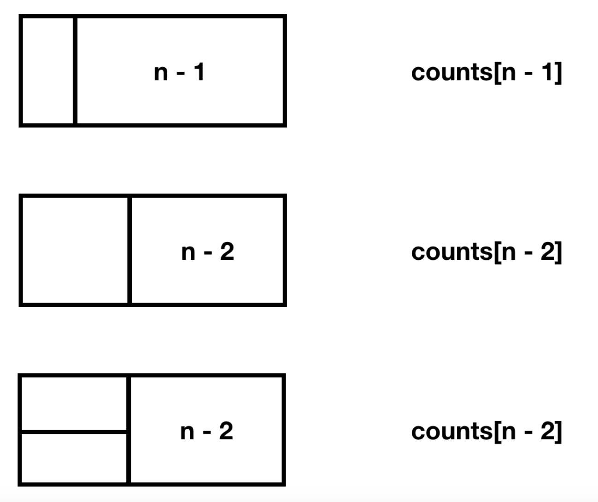

백준 11727: 2 x N 타일링2
======================

문제설명
------

2×n 직사각형을 1×2, 2×1과 2×2 타일로 채우는 방법의 수를 구하는 프로그램을 작성하시오.   


문제풀이
------

Dynamic programming을 이용해 타일의 수를 구한다.   

1. n이 1인 타일을 만들 수 있는 방법의 수는 2 x 1 타일 하나가 필요하다.   
2. n이 2인 타일을 만들 수 있는 방법의 수는 1 x 2 타일, 2 x 1 타일, 2 x 2 타일 하나 씩 총 세개가 필요하다.   
3. 만약 n이 n일 경우 (n-1타일을 만들 수 있는 방법의 수) + (n-2타일을 만들 수 있는 방법의 수) 가 필요하다. 여기서 n-2를 만들 수 있는 방법의 수는 아래의 그림과 같다.   


<p align="center">
  </img>
</p>

즉, DP[n] = Dp[n-1] + (2 * DP[n-2])이 된다.   

```pyhton
   
   dp[1] = 1
   dp[2] = 2
   for i in range(3, n+1):
      dp[i] = dp[i-1] + (2 * dp[i-2])
```

python 코드로 나타내면 위와 같이 나타낼 수 있다.


