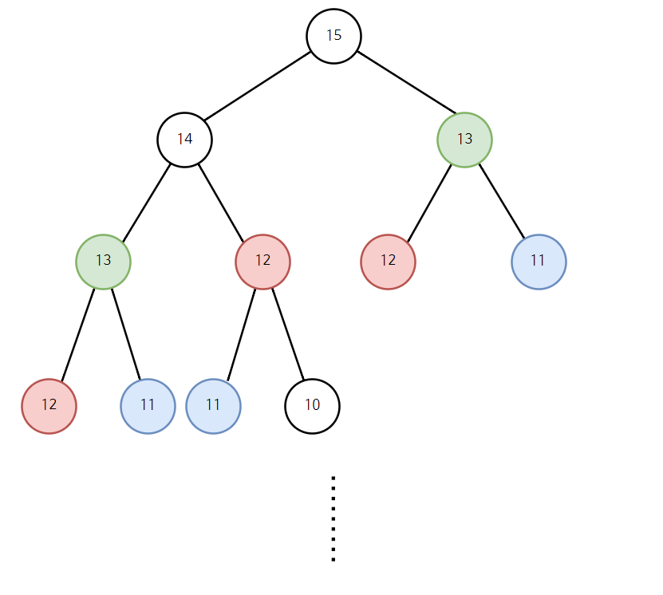

Dynamic programming
===================
큰 문제를 작은 문제로 나눠서 푸는 알고리즘으로 분할 정복법(Divide and Conquer)과 유사하다. 해결된 문제의 답을 저장해두고 그것을 재활용하여 해결된 문제를 다시 푸는 비효율을 제거한다.
해결된 문제의 답을 저장해두고 그것을 재활용하여 해결된 문제를 다시 푸는 비효율을 제거한다. 공간복잡도를 늘리고 시간복잡도를 줄이는 방식이다.   

다이나믹 프로그래밍이란 하나의 문제를 단 한 번만 풀도록 하는 알고리즘이다.
----------------
일반적으로 상당수 **분할 정복 기법은 동일한 문제를 다시 푼다는 단점을 가지고 있다.** (다만 분할 정복 기법은 '정렬'과 같은 몇몇 요소에 대해서는 동일한 문제를 다시 풀게 되는 단점이 없다. 그 예시로 퀵 정렬이나 병합 정렬은 매우 빠르다.) 단순 분할 정복으로 풀게 되면 심각한 비효율성을 낳는 대표적인 예시로서 피보나치 수열이 있다. 피보나치 수열은 **특정한 숫자를 구하기 위해 그 앞에 있는 숫자와 두칸 앞에 있는 숫자의 합**을 구해야 한다.   

**피보나치 수열의 점화식**: D[i] = D[i-1] + D[i-2]   
   
위 공식에 따라서 1, 1, 2, 3, 5, 8, 13, 21, 34, 55, ...와 같이 나아갈 수 있다. 만약에 단순하게 분할 정복 기법을 이용해 15번째 피보나치 수열을 구한다고 가정해 보다. 그러면 다음과 같이 그래프의 형태로 진행 상황을 확인할 수 있다. D[15]를 구하려면 D[14]와 D[13]을 알아야 한다. 다만 D[14]를 알려면 D[13]과 D[12]를 알아야 한다.   

 </img> 

따라서 이런 경우에는 병합 정렬을 할 때처럼 단순한 분할 정복 기법을 사용하면 안된다. 왜냐하면 **이미 해결한 문제를 다시 반복적으로 계산**되었기 때문이다. 위 예시를 보면 이 짧은 순간에 **D[12]가 벌써 3번이나 반복적으로 계산**되었기 때문이다. (빨간색) 따라서 이럴 때는 대신에 동적 프로그래밍 기법을 사용해야 한다.

 

다이나믹 프로그래밍은 다음의 가정하에 사용할 수 있다.   

**1번 가정.** 큰 문제를 작은 문제를 나눌 수 있다.   
**2번 가정.** 작은 문제에서 구한 정답은 그것을 포함하는 큰 문제에서도 동일하다.   

즉, 쉽게 말해 크고 어려운 문제가 있으면 그것을 먼저 잘게 나누어서 해결한 뒤에 처리하여 나중에 전체의 답을 구하는 것이다. 다만 이 과정에서 **'메모이제이션(Memoization)'** 이 사용된다는 점에 분할정복과 다르다. 이미 계산한 결과는 배열에 저장함으로써 나중에 동일한 계산을 해야 할 때는 저장된 갑을 단순히 반환하기만 하면 되는 것이다. 바로 피보나치 수열을 예로 들어 문제를 확인해보자.   

<pre>
   <code>
   
      #include <stdio.h>
    
      int d(int x) {
         if (x == 1) return 1;
         if (x == 2) return 1:
         return d(x-1) + d(x-2);
      }
      
      int main(void) {
         printf("%d", d(10));
      }
   </code>
 </pre>

