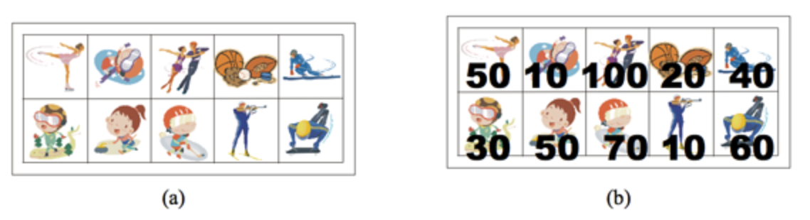

백준 9465 : 스티커
===============

문제설명
------

상근이의 여동생 상냥이는 문방구에서 스티커 2n개를 구매했다. 스티커는 그림 (a)와 같이 2행 n열로 배치되어 있다. 상냥이는 스티커를 이용해 책상을 꾸미려고 한다.   
상냥이가 구매한 스티커의 품질은 매우 좋지 않다. 스티커 한 장을 떼면, 그 스티커와 변을 공유하는 스티커는 모두 찢어져서 사용할 수 없게 된다.   
즉, 뗀 스티커의 왼쪽, 오른쪽, 위, 아래에 있는 스티커는 사용할 수 없게 된다.   

<p align=center>
  </img>
</p>
  
모든 스티커를 붙일 수 없게된 상냥이는 각 스티커에 점수를 매기고, 점수의 합이 최대가 되게 스티커를 떼어내려고 한다.   
먼저, 그림 (b)와 같이 각 스티커에 점수를 매겼다. 상냥이가 뗄 수 있는 스티커의 점수의 최댓값을 구하는 프로그램을 작성하시오.   
즉, 2n개의 스티커 중에서 점수의 합이 최대가 되면서 서로 변을 공유 하지 않는 스티커 집합을 구해야 한다.   
위의 그림의 경우에 점수가 50, 50, 100, 60인 스티커를 고르면, 점수는 260이 되고 이 것이 최대 점수이다.   
가장 높은 점수를 가지는 두 스티커 (100과 70)은 변을 공유하기 때문에, 동시에 뗄 수 없다.   

문제설명
------

이 문제는 Dynamic programming을 이용해 풀 수 있다. 먼저 위의 그림에서 보이듯이 스티커를 떼어내면 스티커를 기준으로 좌,우,위,아래는 떼어 낼 수 없게 된다.   
이 조건을 이용해 점수를 계산하면 스티커를 떼어 낼 수 있는 방법은 해당 위치에서 대각선 방향으로 떼어 낼 수 있다.   
하지만 위의 예제와 같이 스티커를 대각선 한 칸으로 떼어 내게 되면 스티커의 점수가 최대값이 되지 않는 경우가 있다.   
왜냐하면 대각선 한번이동으로 얻어낸 스티커 점수보다 두 번 이동을 통한 얻어낸 점수가 더 커질 수 있기 때문이다. 이 예외상황을 잘 처리해주면 DP를 이용해 스티커의 점수가 최대값을 찾을 수 있다.   
위의 내용을 python code로 나타내면 다음과 같다.   

```python
   steaker[0][1] += steaker[1][0] # 첫 번째 행의 두 번째 열을 두 번째 행의 첫 번째 행과 더함 (why? 대각선 이동이기 때문)
   steaker[1][1] += steaker[0][0] # 두 번째 행의 두 번째 열을 첫 번째 행의 첫 번째 행과 더함
   
   for i in range(2,n): # 두 번째 열 부터 전 대각선 스티커 점수와 그 전 대각선 스티커 점수의 최댓값과 현재 스티커 점수를 DP에 memorization
      steaker[0][i] = max(steaker[1][i-1], steaker[1][i-2]) + steaker[0][i]
      steaker[1][i] = max(steaker[0][i-1], steaker[0][i-2]) + steaker[1][i]
   
   result = max(steaker[0][n-1], steaker[1][n-1]) # steaker 마지막 위치에 저장된 스티커 점수의 최댓값을 return
   
   
