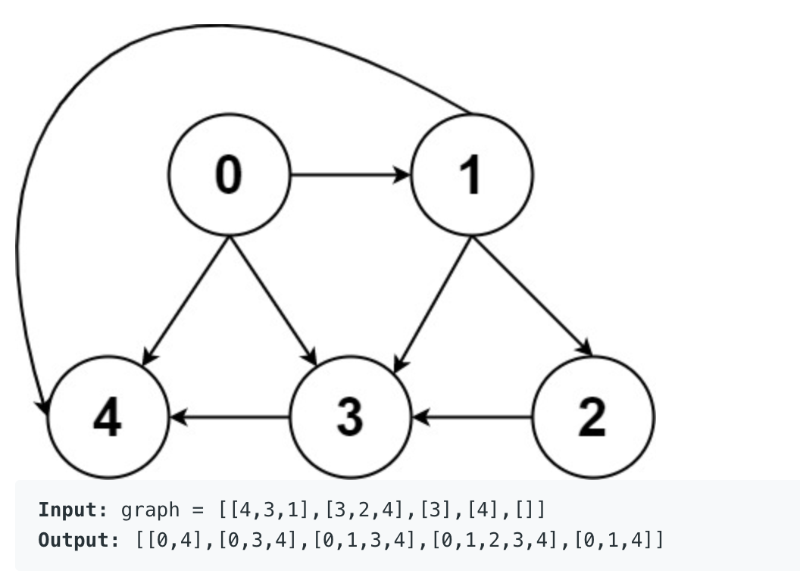

Leetcode : All Paths From Source to Target
==========================================

문제설명
------

Given a directed acyclic graph (DAG) of n nodes labeled from 0 to n - 1, find all possible paths from node 0 to node n - 1, and return them in any order.   
The graph is given as follows: graph[i] is a list of all nodes you can visit from node i (i.e., there is a directed edge from node i to node graph[i][j]).   

<p align="center">
  </img>
</p>

문제풀이
------

이 문제는 stack과 recursive를 이용해 해결할 수 있다.   
주어진 해당 2차원 배열은 해당 인덱스에서 outgoing edge가 배열로 주어져 있다. 예를 들면 [[1,2,3]] 이면 0번 vertex는 1,2,3 vertex에 outgoing edge가 연결 되어 있다.   
이 문제의 해결 목적은 0번 vertex에서 마지막 vertex(leng(graph)-1)까지의 경로를 탐색하는 것이 목적이기 때문에 처음 stack에는 0이 들어간다.   
마지막 목적지가 마지막 vertex이기 때문에 recursive의 종료 조건은 0에서 출발한 vertex가 마지막 vertex에 도착했을 때 이다.   
위의 접근법을 이용해 python code를 구현하면 다음과 같다.   

```python
   stack = [0]
   def find_path(src,des): # src : source(출발지점에서 이동하는 vertex 정보), des : destination(목적지(len(graph)-1))
    if src == des:
      answer.append(stack.copy()) # stack에는 이동경로가 저장되기 때문에 stack의 배열이 이동경로이다.
      return 
    for i in grpah[src]: # src에 연결되어 있는 vertex들
        stack.append(i)
        find_path(i,des)
        stack.pop() # find_path function으로 통해 목적지까지 간다음 뒤로 돌아 올때 연결된 부분이 없으면 pop을 통해 경로를 지워준다.
 ```
 
 위의 code를 간단히 설명하면 source -> destination 까지 계속 진행 하다가(stack push) destination에 도착하면 answer에 이동경로(stack)을 추가한다.   
 추가하고 돌아오면서 다른 vertex에 연결되어 있는지 확인한 후 pop()을 진행한다.   
   
